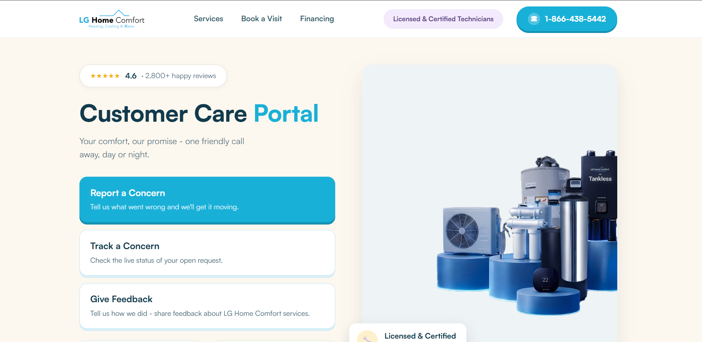
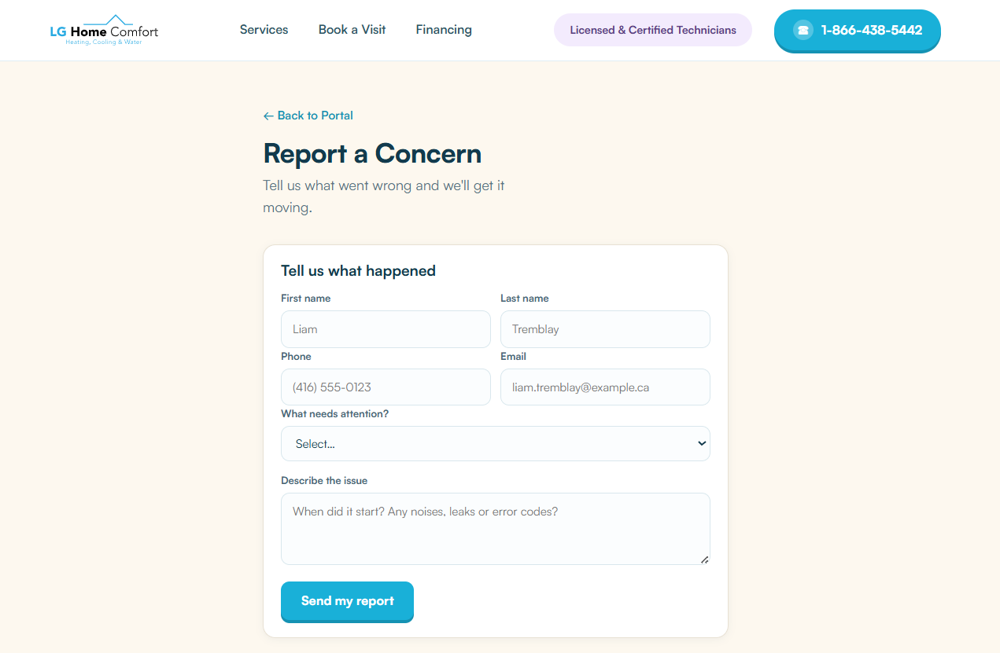
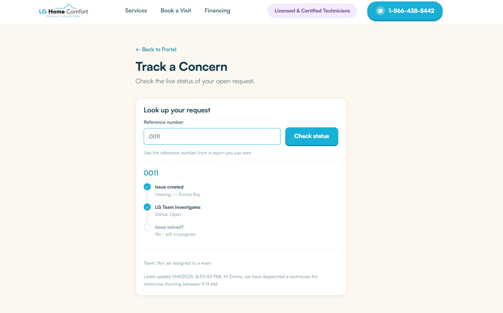
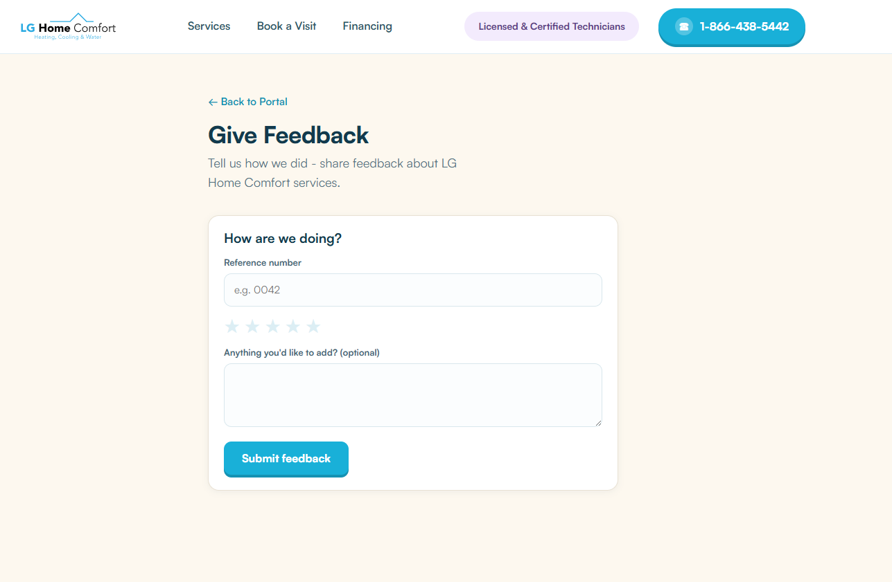

# LG Home Comfort — Customer Care Portal

A customer-facing support portal for **LG Home Comfort** (HVAC/home-services company)
built on top of **Frappe Helpdesk**. Customers register concerns, track ticket status,
and leave feedback without ever touching the Frappe desk UI.









## Architecture

```
Browser
  │
  ▼
portal-frontend (React + Vite, :5173)
  │  fetch()
  ▼
portal-backend (Express, :4000)
  │  Frappe REST API (token auth)
  ▼
Frappe Helpdesk (Docker, :8000)
  └─ HD Ticket doctype (+ custom fields)
```

- **Frappe** is the system of record — every ticket, status, and feedback rating
  lives on the `HD Ticket` doctype.
- **portal-backend** is a thin, stateless proxy. It never stores anything itself;
  it just translates simple REST calls into authenticated Frappe API calls.
- **portal-frontend** is the only thing an end customer ever sees. It never talks
  to Frappe directly — only to `portal-backend`.

Sub-project docs:
- [`portal-backend/README.md`](portal-backend/README.md)
- [`portal-frontend/README.md`](portal-frontend/README.md)

## Running Frappe (Docker)

```bash
docker compose up -d      # starts mariadb, redis, frappe (runs init.sh on first boot)
docker compose logs -f frappe   # watch it come up
```

`init.sh` (runs automatically inside the `frappe` container):
1. `bench init` a fresh bench (skipped if one already exists)
2. Installs the `telephony` and `helpdesk` apps
3. Creates the site `helpdesk.localhost`
4. Enables `developer_mode`, `mute_emails`, `server_script_enabled`
5. Runs `bench start`

**Credentials (local dev only):**
| | |
|---|---|
| Site | `helpdesk.localhost` |
| Admin login | `Administrator` / `admin` |
| MariaDB root password | `123` |

**URLs:**
- Agent/Helpdesk UI: http://localhost:8000/helpdesk
- Admin desk: http://localhost:8000/app

If the container was stopped (e.g. after a reboot), bring it back with
`docker compose start` — no need to re-run `docker compose up` unless you want
to rebuild.

### Required custom fields on `HD Ticket`

The portal writes to these fields — they must exist before `portal-backend` can
create tickets successfully. Add via `http://localhost:8000/app/custom-field/new`
(set **Document Type** = `HD Ticket` each time):

| Label | Field name (auto-generated) | Type | Options |
|---|---|---|---|
| Mobile | `custom_mobile` | Data | — |
| City | `custom_city` | Data | — |
| Invoice No | `custom_invoice_no` | Data | — |
| Service Type | `custom_service_type` | Select | `Heating`, `Cooling`, `Water Solutions`, `Air Quality`, `Generators`, `Security`, `Other` |
| Escalation Reason | `custom_escalation_reason` | Small Text | — |

⚠️ Make sure the **Label** has no leading/trailing space — Frappe derives the
fieldname from it, and a stray space produces a broken fieldname like
`custom__city` (double underscore) that silently fails to save.

Feedback (star rating + comment) uses fields Frappe Helpdesk already ships with:
`feedback_rating` (Rating, stored as a 0–1 fraction) and `feedback_extra` (Long
Text, free-form comment). Do **not** write to the `feedback` field — it's a Link
field restricted to a predefined list of canned phrases (`HD Ticket Feedback
Option`), not free text.

### API credentials

1. `http://localhost:8000/app` → **User List** → **Administrator**
2. Scroll to **API Access** → **Generate Keys**
3. Copy the API Key and API Secret (the secret is shown once)
4. Put both in `portal-backend/.env` (`FRAPPE_API_KEY`, `FRAPPE_API_SECRET`)

For a real deployment, create a dedicated `portal-api@lghomecomfort.ca` user
scoped to only the permissions the portal needs, instead of using
Administrator.

## Running the full stack locally

```bash
# 1. Frappe
docker compose up -d

# 2. Backend
cd portal-backend
cp .env.example .env   # fill in FRAPPE_API_KEY / FRAPPE_API_SECRET
npm install
npm run dev             # http://localhost:4000

# 3. Frontend
cd portal-frontend
npm install
npm run dev             # http://localhost:5173
```
